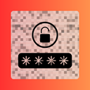

<h1 align="center">
  <a href="https://chromewebstore.google.com/detail/ljcebnkehgbobhboghmnmgmmdjjhhjoe?utm_source=item-share-cp">
     Weblur
  </a>
</h1>

Weblur is a Chrome extension that protects your privacy by blurring specified websites until a valid passkey is entered. With Weblur, you can configure a custom passkey, username, and a list of websites that you want to keep hidden until authenticated.

## Features

- **Customizable Settings:**
  - Set your own passkey and username during initial setup.
  - Configure a custom list of websites to be blurred.
- **Privacy Protection:**
  - Automatically blurs pages that match your configured list.
  - An overlay with a passkey input appears on protected pages.
- **User-Friendly Interface:**
  - Auto-focused passkey input with Enter key support.
  - Animated social media icons in the settings popup.
- **Gmail Compose Integration:**
  - Preconfigured mail icon opens Gmail’s compose window with preset email details.

## Installation

**Get your Weblur Extension**

 [](https://chromewebstore.google.com/detail/ljcebnkehgbobhboghmnmgmmdjjhhjoe?utm_source=item-share-cp)
[](https://microsoftedge.microsoft.com/addons/detail/weblur-we-value-your-pr/bnmpcobaiolfekooibdlbfoiknbhfppg)


**Installing from GitHub**

1. **Clone or Download the Repository:**
   ```bash
   git clone https://github.com/satya-mehta/Weblur.git

2. **Load the Extension in Chrome:**

3. **Open Chrome and navigate to chrome://extensions/**

4. **Enable Developer Mode (toggle in the top-right corner).**

5. **Click Load unpacked and select the repository folder.**

## Initial Setup:

- On first installation, if the extension detects that the passkey, username, or website configurations are missing, it will automatically open the configuration page (popup) for you to set up these values.
Usage
- Initial Setup:
 - - When you install the extension for the first time, you'll be prompted to configure your settings. Enter your desired username, passkey (with confirmation), and the list of websites you want to protect.

## Accessing Protected Websites:
 - When you navigate to a website in your configured list, an overlay appears that blurs the page. Enter the correct passkey to remove the blur and access the page.

## Editing Settings:
 - Click the extension icon to open the settings popup. To modify your settings, verify your current passkey to unlock the configuration form where you can update your username, websites list, and change your passkey.

## File Structure
 - manifest.json: Defines the extension configuration (permissions, background, content scripts, etc.).
 - background.js: Handles installation events (e.g., auto-opening the configuration page on first install) and passkey verification.
 -  content.js: Applies the blur effect on protected websites and displays an overlay with a passkey input.
 - popup.html & popup.js: Provide the user interface for initial setup and settings management.
 - blur.css (if applicable): Contains additional styles for the blur effect (if separated from content.js).

## Customization

 - Social Media Icons:
 - The popup includes animated social media icons for Twitter, GitHub, LinkedIn, and Mail. These icons slide in from left to right. You can update the links and icons in popup.html as desired.

 - Styling & Animations:
 - Feel free to adjust the CSS styles in popup.html and the overlay in content.js to match your desired look and feel.

## Contributing
 - Contributions are welcome! If you have suggestions, improvements, or bug fixes, please follow these steps:

#### Open an Issue: Report your ideas or bugs in the repository’s Issues section.

#### Fork the Repository: Create a personal fork and make your changes.
#### Submit a Pull Request: Once your changes are ready, submit a pull request with a clear description of your modifications.

#### License
 - This project is licensed under the MIT License.See below for details or refer to the [LICENSE](LICENSE) file.